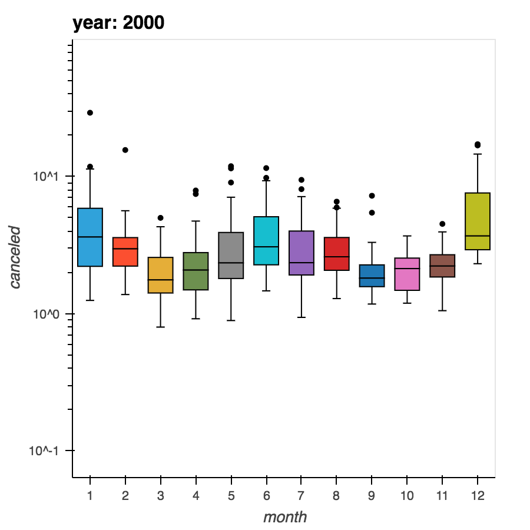
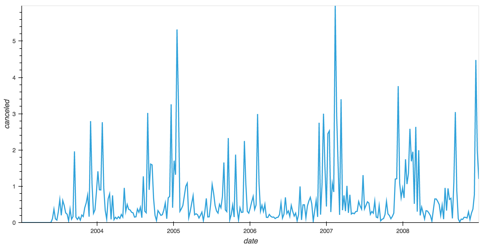
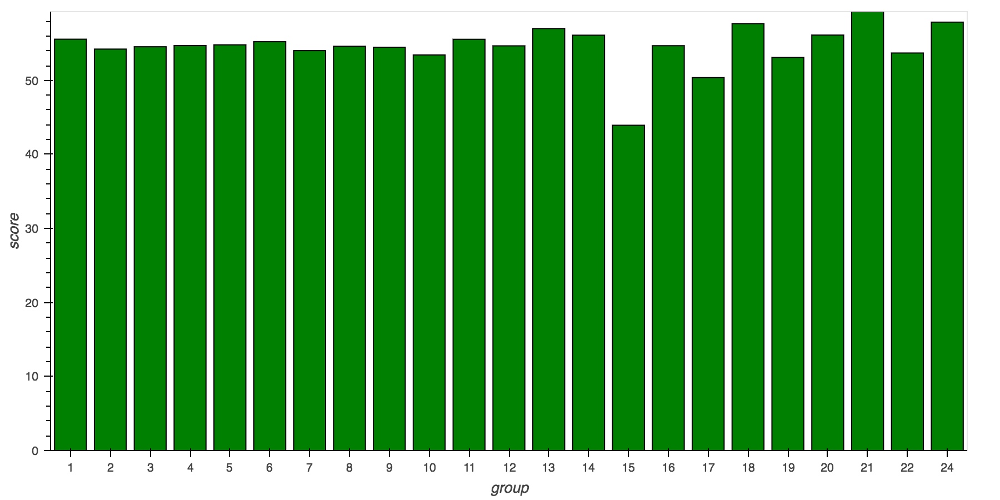
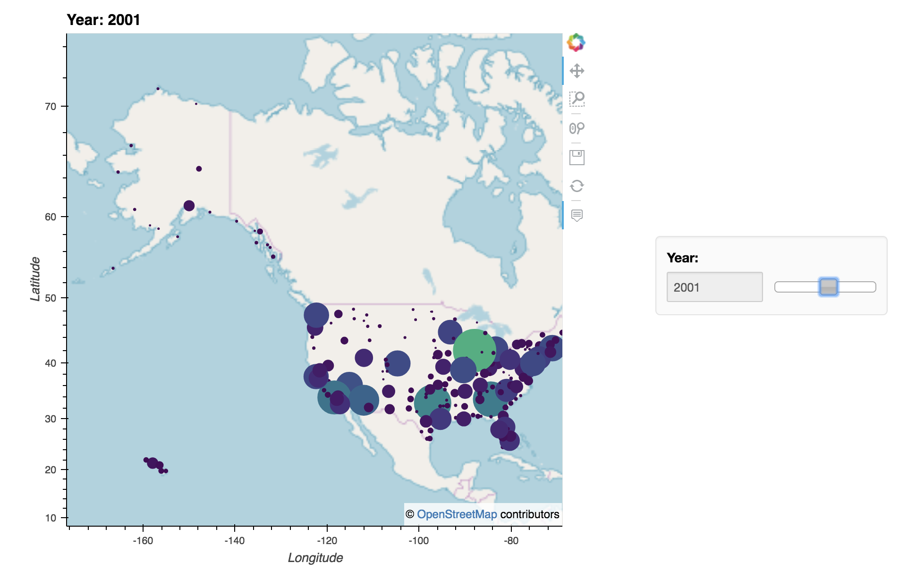
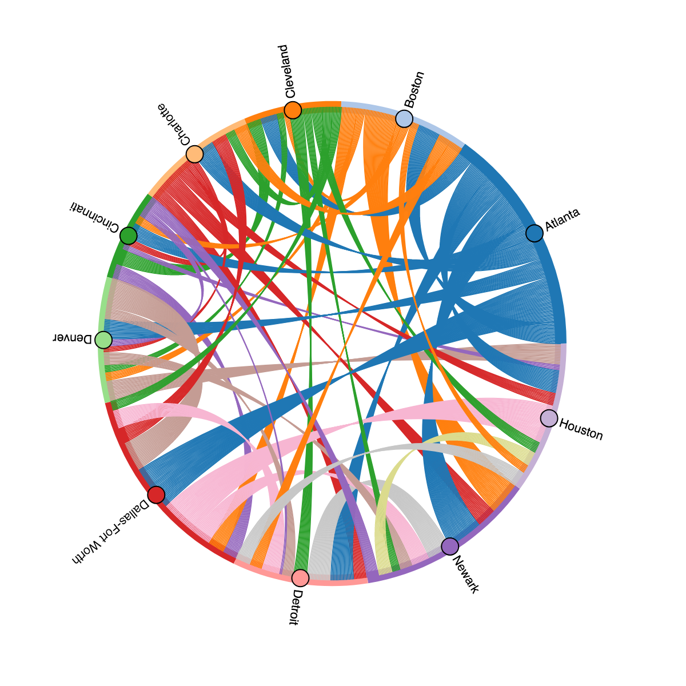

# Big Data Project
Big data project for the "Middleware Technologies for Distributed Systems" course at Polimi.

The goal of the project is to infer qualitative data regarding USA flights during the years 1994-2008. The data can be downloaded from http://stat-computing.org/dataexpo/2009/the-data.html .

## Required libraries

For the pyspark queries (minedata.py):
* pyspark
* spark
* hadoop

For the queries visualization rendering:
* Jupyter Notebook
* Holoviews + Geoviews + Bokeh

## Queries results screenshots

First query (percentage of canceled flights per day)

Second query (weekly percentages of delays that are due to weather):

Third query (distance groups delay score):

Fourth query (weekly penalty score, grouped by year in the map plot):

Additional data analysis (number of flights between airports monthly).
In the graph only the 10 "busiest" airports are shown in a chosen month, in the notebook the year and month can be chosen.

## Who
Marco Bacis - MSc Student @ Politecnico di Milano - marco.bacis@mail.polimi.it
Daniele Cattaneo - MSc Student @ Politecnico di Milano - daniele3.cattaneo@mail.polimi.it
